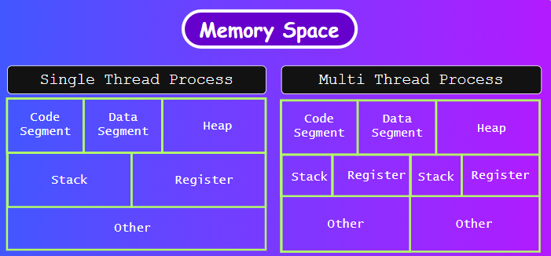
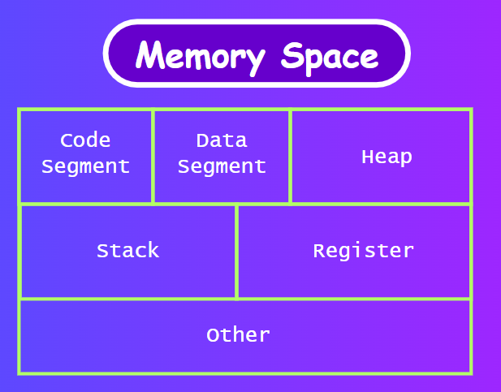

Description

**Topics Covered**
- Program 
- Process
- Thread and type
- Memory Space

---
#### Program & Process

- Program:  Sequence of instruction written in programming languages. Example: .exe app file
- Process: It is a instance of a program that is being executed. Example: searching in chrome
	1. Every process have a separate memory space
	2. I/O requirement slows program (switching)

---
#### Thread
- A unit of execution within a process. Example: click on search bar
- Types:
	1. Single Threaded Process: one memory space
	2. Multi  Threaded Process: many memory space

---
#### Memory Space

---